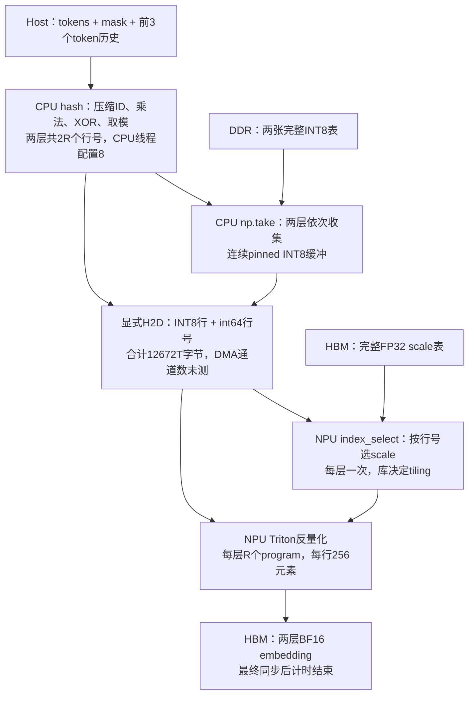
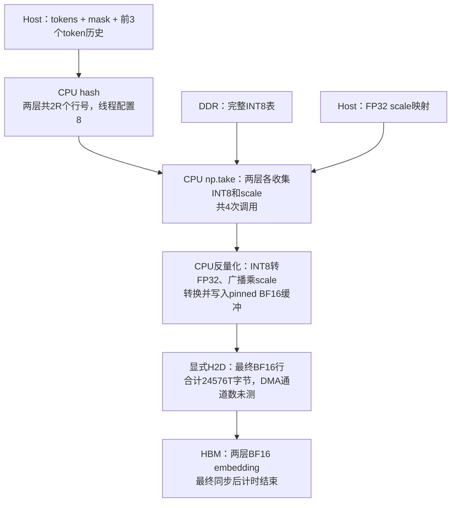
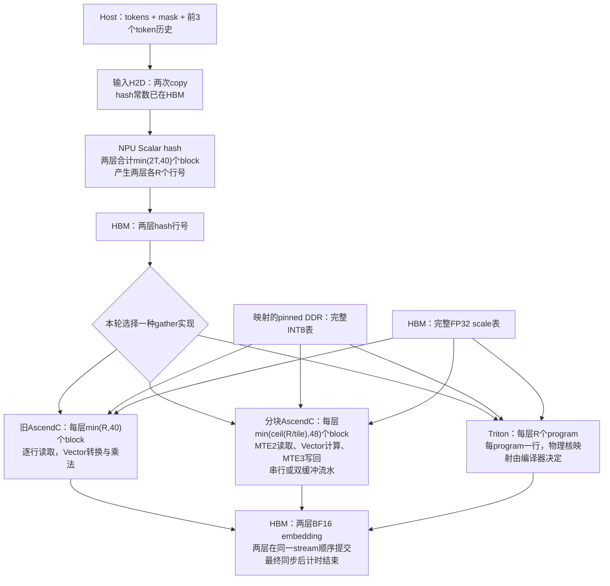

# Ascend A3 Engram：三种执行路径与 UVA 实验

本仓库比较集中部署下的三种执行路径：**CPU 收集后由 NPU 反量化、CPU 收集并反量化、NPU hash 后通过 UVA 直接读主存**。下面每章对应一条完整路径。真实权重实验入口为 [`benchmark/bench_pipeline_e2e.py`](benchmark/bench_pipeline_e2e.py)，复现步骤见 [benchmark README](benchmark/README.md)。

共同计时边界是：**host token IDs、mask 和前 3 个 token 的历史已经准备好，直到两层 BF16 embedding 在 HBM 中可用，并完成终点同步**。不包含权重加载、后续投影、门控、卷积、完整模型、网络服务或跨 rank 通信。CPU 路径是本仓库的 PyTorch/NumPy 参考基线，不是对上游 vllm-ascend 服务的性能测量。

### 数量与硬件口径

- `B` 为 batch，`S` 为本轮每条序列的 token 数，`T = B × S`。
- 每个 token、每个 Engram 层产生 `3 × 8 = 24` 个行号。**每层**查询行数 `R = 24T`，两层合计 `2R` 行。
- 两张完整 INT8 表约 **183.11 GiB**，放在 pinned 主存 DDR；两张完整 FP32 scale 表约 **22.89 GiB**，常驻 HBM。每行 256 个 INT8，每 32 个元素一个 scale，即每行 8 个 FP32 scale。
- 实测单个 Ascend910_9392 设备报告 **48 个 Vector Core**。表中的 block 数是 AscendC 启动参数，program 数是 Triton 逻辑任务数，均不等于 profiler 测出的同时活跃核数或利用率。
- A3 不需要 SIMT 才能计算 hash。这里用设备 **Scalar 标量运算**完成整数乘法、XOR、取模与循环，再在不同 block 之间分配任务。`num_warps=4` 不能解释为 4 个 A3 核或 CUDA warp。
- 流水 gather 显式指定 `KERNEL_TYPE_AIV_ONLY`。其他自写 kernel 没有显式声明该模式，其具体任务类型要以编译产物为准。下文“Scalar / Vector / MTE”描述源码所表达的工作，没有给出未经 profiler 验证的硬件占用数。这些自写算子不调用 Cube 矩阵乘。
- CPU 设置 `torch.set_num_threads(8)`，复现命令设置 `OMP_NUM_THREADS=8` 和 `OPENBLAS_NUM_THREADS=8`。这是线程配置，不能声称每次 NumPy gather 或 PyTorch 操作都用满 8 个 CPU 核。

## 场景一：CPU hash、收集 INT8，NPU 反量化

对应结果中的 **`cpu_stage`**。CPU 先算出两层行号，从主存收集 INT8 行到连续 pinned 缓冲，然后将这些行及行号送入 HBM。NPU 根据行号读取已经驻留 HBM 的 scale，再反量化。

| 阶段 / 实现 | 具体功能与数据位置 | 使用的单元 | 数量与启动方式 |
|---|---|---|---|
| 官方 `NgramHashState` CPU 路径 | token 压缩映射、mask/历史处理、整数乘法、XOR、质数取模、加 offset；结果写入 pinned 行号缓冲 | CPU 执行 PyTorch 张量运算 | 每轮调用一次，计算两层共 `2R` 个行号；线程配置 8，实际核占用未测 |
| `np.take` | 按行号从 DDR INT8 表收集到 pinned `codes` | CPU 主存读取与写入 | 每层调用一次，共两次；每层 `R × 256` 字节，无显式 gather 线程池 |
| `cg.copy_`、`ids.copy_` | pinned INT8 行与 int64 行号显式 H2D | 运行时内存复制路径，不是 Vector 反量化 | 两次框架 copy 调用，覆盖两层；具体 DMA 通道数未测 |
| `torch.index_select` | 在 HBM scale 表中选取每行 8 个 FP32 scale，写入连续 HBM 缓冲 | torch_npu 内置设备索引算子 | 每层调用一次；核数由库实现/tiling 决定，本仓库未指定，未解析其编译产物 |
| `_engram_int8_dequant_kernel` | 从 HBM 读取 INT8 与已选好的 scale，转换、相乘，写 BF16 HBM 输出 | Triton 设备逐元素运算与内存访问 | 每层一个 launch，grid=`(R,)`，每个 program 处理一行 256 元素，`num_warps=4`；物理核映射未测 |
| `torch.npu.synchronize` | 等待输出真正就绪，结束 E2E 计时 | Host 等待设备完成 | 每个计时样本一次，不是新的计算 kernel |

两层显式 H2D 数据量为 `2R × (256 + 8) = 12,672T` 字节。scale 已在 HBM，不在这条 H2D 数据量内。两层 scale 选择依次提交，随后两层反量化依次提交。



## 场景二：CPU hash、收集并反量化，BF16 送入 NPU

对应结果中的 **`cpu_dequant`**。CPU 完成 hash、INT8/scale 查表及反量化。NPU 接收最终 BF16 行，这条路径没有自写 NPU hash 或反量化 kernel。

| 阶段 / 实现 | 具体功能与数据位置 | 使用的单元 | 数量与启动方式 |
|---|---|---|---|
| 官方 `NgramHashState` CPU 路径 | 与场景一相同，计算两层行号 | CPU PyTorch 运算 | 每轮一次，两层共 `2R` 个行号，线程配置 8 |
| `np.take` INT8 / scale | 从 DDR 收集 INT8 行，并从 host scale 映射收集对应 scale | CPU 主存访问 | 每层各两次 `np.take`，两层合计四次；每行读取 256 字节 INT8 + 32 字节 scale |
| `codes.float()`、广播乘法、`bf.copy_` | INT8 转 FP32，按 `[2,R,8,32]` 展开使用 scale，乘法后转 BF16，写入 pinned 输出缓冲 | CPU PyTorch 转换和逐元素运算 | 处理两层共 `2R × 256` 个元素；线程配置 8，实际并行度随底层实现决定 |
| `out.copy_(bf, non_blocking=True)` | 将 pinned BF16 结果显式 H2D | 运行时内存复制路径 | 一次框架 copy 调用，覆盖两层；DMA 通道数未测 |
| `torch.npu.synchronize` | 等待 H2D 完成 | Host 等待设备完成 | 每个计时样本一次 |

两层显式 H2D 数据量为 `2R × 256 × 2 = 24,576T` 字节。为保持同一实验环境，HBM 中仍保留完整 scale，但此路径计算读取的是 **host scale**。CPU 临时转换/乘法缓冲的开销计入 E2E。



## 场景三：NPU hash，UVA 直接读取主存 INT8 表并反量化

对应 **`ascendc_uva`、`triton_uva`、`pipeline_uva`、`serial_tiled_uva`、`pipeline16_uva`**。这些路径共用同一个 AscendC hash，然后选择其中一种 gather/dequant 实现。图中的 gather 分支是互斥测试方案，不会全部执行。

### 算子实现与单元分工

| 阶段 / 源码 | 具体功能 | 使用的单元 | 数量与启动方式 |
|---|---|---|---|
| 输入 `copy_` | pinned token IDs 和 mask（包含前3个历史位置）送入 HBM；hash 常数提前驻留 HBM | 运行时 H2D 复制 | 两次框架 copy 调用，输入量 `12B(S+3)` 字节，DMA 通道数未测 |
| [`hash_e2e.asc`](benchmark/hash_e2e.asc) | 每个任务处理一个 token、一个层；压缩映射、历史截断、整数乘法/XOR/取模，产生 24 行号 | 设备 Scalar 运算；DataCopy 写回 hash | **一次 launch 包含两层**，`min(2T,40)` 个 block；任务超过 block 数时按步长循环。核内 head 循环是标量串行，不是 SIMT |
| [`gather.asc`](benchmark/gather.asc) | 逐行从映射 DDR 取 256 个 INT8，转换 INT8→FP16→FP32，按 8 个 scale 分段乘法，再转 BF16 写 HBM | Scalar 读取行号/scale；Vector Cast/Muls；DataCopy 搬运，较多全流水屏障 | 每层一次 launch，`min(R,40)` 个 block，按 block 步长逐行处理 |
| [`gather_pipeline.asc`](benchmark/gather_pipeline.asc) | 按 tile 读取行号和 INT8/scale，向量广播 scale 后乘法，输出 BF16；支持相同分块的串行与流水对照 | **AIV-only**。Scalar 处理索引/循环；MTE2 将行号、DDR INT8、HBM scale 读入 UB；Vector Cast/Brcb/Mul；MTE3 将输出写回 HBM | 每层一次 launch，`min(ceil(R/tile),48)` 个 block；每个 block 两个输入队列槽、两个输出队列槽。双缓冲不增加核数，也不证明一定有效重叠 |
| 上游提取的 Triton gather/dequant | 每个 program 从行号定位真实 DDR 行，读取 INT8 与 HBM scale，反量化后写 BF16 | Triton 设备内存访问与逐元素运算；实际 Scalar/Vector/搬运指令由编译器生成 | 每层一次 launch，grid=`(R,)`，每个 program 处理一行，`WIDTH=256`、`num_warps=4`。program 数不是物理核数，4 也不是 A3 核数 |
| 最终同步 | 两层结果均就绪后结束计时 | Host 等待设备完成 | 每个计时样本一次 |

设备 hash 的数学定义是 `rolling_n = XOR(ids[j] × multiplier[layer,j])`，再计算每个 head 的 `rolling_n % prime[layer,n,head] + offset[layer,n,head]`。乘数由 host 初始化，实际 token 对应的乘法、XOR、取模在 device 执行。64 位运算可能编译成多条指令，源码不能证明单指令吞吐。

`gather_pipeline.asc` 中的 `CopyIn`、`Compute`、`CopyOut` 是**同一个 kernel 内部的阶段**，不是三次 kernel launch。流水版本先提交后续 tile 的读取，再计算当前 tile；串行对照在每个 tile 后执行全流水屏障。所有版本的两层 gather 都在同一个当前 stream 上依次提交，不能将两层启动核数相加为同时占用核数。

### 当前 benchmark 实际启动数量

当 `R < 320` 时，三个 tiled 路径都使用 **tile=1**；否则 `pipeline_uva` / `serial_tiled_uva` 使用 tile=8，`pipeline16_uva` 使用 tile=16。这是当前 benchmark 的条件选择，不是所有 shape 都固定 tile=16。

| `[B,S]` | `T` | 每层 `R` | Hash block（两层合计） | 旧 gather block / 层 | 流水8及串行8 block / 层 | 流水16 block / 层 | Triton program / 层 |
|---|---:|---:|---:|---:|---|---|---:|
| `[1,1]` | 1 | 24 | 2 | 24 | 24，tile=1 | 24，tile=1 | 24 |
| `[8,1]` | 8 | 192 | 16 | 40 | 48，tile=1 | 48，tile=1 | 192 |
| `[32,1]` | 32 | 768 | 40 | 40 | 48，tile=8 | 48，tile=16 | 768 |
| `[512,1]` | 512 | 12,288 | 40 | 40 | 48，tile=8 | 48，tile=16 | 12,288 |
| `[8,512]` | 4,096 | 98,304 | 40 | 40 | 48，tile=8 | 48，tile=16 | 98,304 |

UVA 并不消除 DDR 数据流量：两层每 token 仍需读取 `2 × 24 × 256 = 12,288` 字节 INT8，另有 HBM scale 读取与 BF16 写回。它省去的是 CPU 收集到中转缓冲再显式 H2D 的执行路径。40 与 48 的 block 上限也是旧版和流水版之间的差异，不能把所有性能改善归因于流水；同 tile、同核数的串行/流水消融才用于衡量流水收益。



以上为源码与启动配置审计，尚未取得逐算子的硬件 profiler 数据，因此不报告具体 Scalar/Vector/MTE 忙碌比例、实际 DMA 通道数、Triton 物理核占用或带宽利用率。复现和计时限制见 [benchmark README](benchmark/README.md) 与 [流水说明](benchmark/PIPELINE.md)。

---

## 附：早期小表功能 demo

ngram.asc 将 hash、稀疏测试表二分查找、DDR gather 和标量反量化放在一次 kernel 中，启动 2 × B × count 个 block。每个 block 处理一个 token、一个层，Scalar 完成 hash/二分/逐元素反量化，DataCopy 完成行读取和结果写回；不是上面的 Vector 流水算子。默认整段测试 B=2、count=8，启动 32 个 block。

下面是根目录 `engram.asc` 的独立功能验证，不是上述完整真实权重性能测试。它使用合成小表、每行一个 scale，输出 INT8 和 FP32。不能用它的测试结果替代上述三种场景的性能结果。

在 Ascend A3 上验证：Device 计算 DeepSeek-V4.1-Flash Engram hash，直接读取映射的主机 DDR int8 表，将选中行 gather 到 HBM，并使用 HBM 中的 scale 反量化。

这是已运行验证的功能原型，不是完整 Engram 模块，也不是优化后的性能实现。

### 数据路径

```text
HBM: token IDs、mask、token 压缩映射、hash 常数
  → A3 Device: 计算 2/3/4-gram hash
  → 根据真实逻辑行号查找测试表中的物理行
  → pinned Host DDR: 读取 int8 行（256 bytes/row）到 UB
  → HBM: 输出 gather 后的 int8 行
  → 使用 HBM 中的 FP32 scale，输出反量化 FP32 行
```

Host 使用 `aclrtMallocHost` 分配 pinned memory，再调用 `aclrtHostRegisterV2(..., ACL_HOST_REG_MAPPED)` 和 `aclrtHostGetDevicePointer`。Kernel 收到的是映射后的 Device 地址。CPU 地址与 Device 地址不要求相同。全表不做 H2D 拷贝，只有选中的行进入算子的片上 UB 和输出 HBM。

### Hash 与测试数据

参考 [DeepSeek 官方 engram.py](https://huggingface.co/deepseek-ai/DeepSeek-V4.1-Flash/blob/main/inference/engram.py)。下载脚本固定模型 revision，并逐文件验证 SHA256；第三方源文件和 tokenizer 不随本仓库分发。

- 使用真实 tokenizer，归一化压缩词表大小为 99092。
- 层号 1、14；2/3/4-gram 各 8 个 head；每层每 token 查询 24 行。
- Host 根据官方实现生成压缩映射、乘数、质数和偏移；Device 执行实际 token hash。
- padding、mask 引起的历史截断，以及 lookback 顺序遵循官方实现。

测试只物理存储假 token 命中的 **720 行**，按 `(layer, logical_hash)` 排序。Device 二分查找该稀疏测试表；没有二次取模，也没有更改官方 hash 行号。生产版完整表或分片表需替换这层测试映射。当前输入是两个各 8 token 的序列。

int8 数据为确定性合成数据，不是 checkpoint 权重。量化约定为每行一个 FP32 scale：`value = int8 * scale`，不代表原模型 checkpoint 的量化布局。此 demo 不包含后续 projection、gating、卷积或完整模型精度验证。

### 运行

已验证环境：Linux aarch64、Ascend910_9392（A3）、CANN 9.1.0、PyTorch 2.12.0。需要 CANN 自带 bisheng、Ascend C 头文件和 AscendCL 动态库。

```bash
source /usr/local/Ascend/ascend-toolkit/set_env.sh
# 使用已有 CANN/PyTorch 环境；requirements.txt 列出 Python 依赖。
python3 download_reference.py
bash run.sh
```

默认使用逻辑 Device 0。Kernel 构建目标为 `dav-2201`。测试只释放自己的内存和 stream，不调用设备 reset。输出 `ALL PASS` 表示逐项比对成功；详细结果写入 `result.json`。

### 已验证结果

[数值证据](results/a3-functional.json)：8 组执行全部通过。

| 检查 | 结果 |
|---|---|
| Device hash 与官方 CPU oracle | 0 mismatch |
| DDR int8 → HBM gather | 0 mismatch |
| HBM scale 反量化 | 最大绝对误差 0 |
| 整段与 3+4+1 分段输入 | 一致 |
| 序列起点、重复 token、mask 边界 | 通过 |
| 同步后 CPU 修改 DDR，再运行 | 读到更新值 |

共校验 3072 个 hash，int8 与 FP32 输出各校验 786432 个元素。表占主存 184320 bytes，scale 占 HBM 2880 bytes。原型含标量 hash/反量化和顺序小块 gather，尚未报告带宽或时延。

测试严格在 stream 完成后才修改或释放 Host 表，不能由此推断 CPU/NPU 无同步并发更新安全。分段测试提供完整 token 历史，kernel 只读取当前及以前的位置；生产请求历史状态管理不在本 demo 范围内。

### 文件

- `engram.asc`：Device hash、DDR gather、反量化。
- `test_engram.py`：官方 oracle、内存映射、测试与清理。
- `download_reference.py` / `reference-checksums.json`：可追溯的官方参考下载。
- `run.sh`：编译与运行。

### 2026-09-17：真实权重 E2E 与流水化实验

新增 [当日工作总结](SUMMARY-2026-09-17.md)、[完整性能报告](benchmark/report-pipeline.html) 和 [复现步骤](benchmark/README.md)。包含两层完整真实表、CPU/NPU 分工、七条路径的 shape 对比与阶段拆分、双缓冲消融，以及 raw ACL 发射顺序问题的修正。流水版大 shape 仍落后于 Triton，具体限制见总结。

### 更新源码后的复现

根目录 `bash run.sh` 会重新编译 `engram.asc` 再执行合成小表功能验证。真实权重性能测试请使用 [benchmark 复现步骤](benchmark/README.md#复现)，先执行 `bash build.sh` 重建三个动态库，不能使用根目录小表 demo 代替。

2026-09-18 的修改仅整理 AscendC 可读性及复现入口，尚未进行新的设备运行。历史结果与 provenance 保持原样，重新构建的源码及动态库身份单独记录在 `benchmark/build-manifest.json`。
